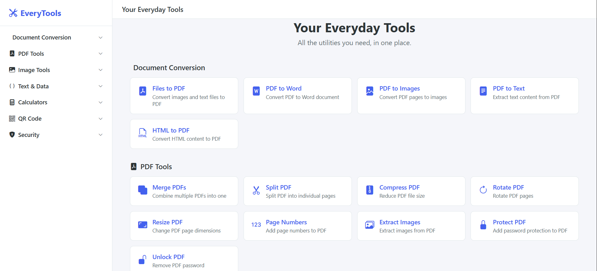
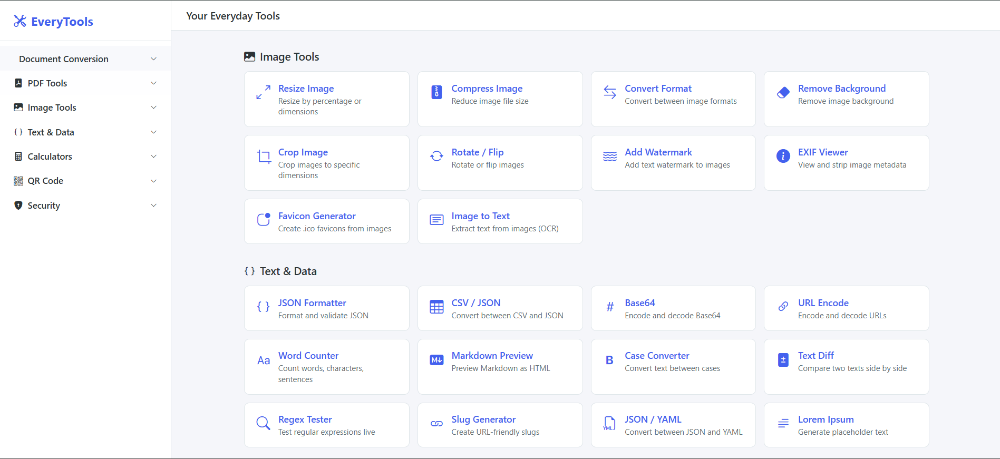
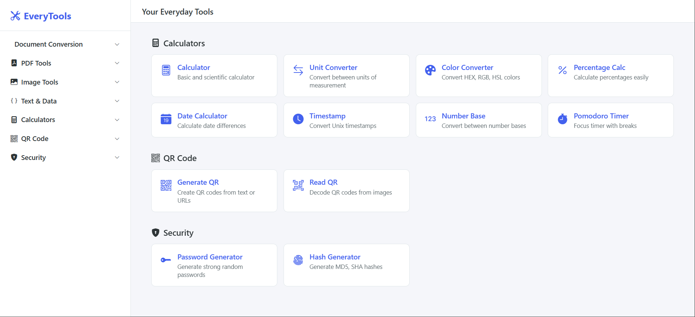

# EveryTools Atelier

A lightweight app that bundles practical utilities into one calmer workspace. Built with Python + Flask, redesigned into a cleaner atelier-style interface, and focused on document, image, and daily household workflows.


---

## Screenshots







---

## Features

### Document Conversion
| Tool | Description |
|------|-------------|
| **Files to PDF** | Convert images (JPG, PNG, BMP, TIFF, WebP), Word documents (.docx), and text files to PDF |
| **PDF to Word** | Convert PDF documents to `.docx` format |
| **PDF to Images** | Export each PDF page as PNG or JPG (configurable DPI) |
| **PDF to Text** | Extract all text content from a PDF |
| **HTML to PDF** | Convert HTML content to a PDF document |
| **OCR PDF** | Make scanned PDFs searchable (image + hidden text layer) or extract text — 14 languages supported |
| **CAD to PDF/Image** | Convert DXF drawings to PDF or PNG (DWG via optional ODA File Converter) |

### PDF Tools
| Tool | Description |
|------|-------------|
| **Merge PDFs** | Combine multiple PDF files into one document |
| **Split PDF** | Split a PDF into individual pages or custom page ranges |
| **Compress PDF** | Reduce PDF file size (low / medium / high compression) |
| **Rotate PDF** | Rotate all or specific pages (90, 180, 270 degrees) |
| **Resize PDF** | Scale pages by percentage or fit to standard paper sizes (A3–A5, Letter, Legal) |
| **Page Numbers** | Add page numbers with configurable position, font size, and start number |
| **Watermark PDF** | Add text or image watermarks with opacity, rotation, placement, tiling, page ranges, and front/back layering |
| **Extract Images** | Extract all embedded images from a PDF |
| **Protect PDF** | Encrypt a PDF with user and owner passwords (AES-256) |
| **Unlock PDF** | Remove password protection from a PDF |

### Image Tools
| Tool | Description |
|------|-------------|
| **Resize Image** | Resize by percentage or exact pixel dimensions (with aspect ratio lock) |
| **Compress Image** | Reduce file size with adjustable quality slider (10–100%) |
| **Convert Format** | Convert between PNG, JPG, WebP, BMP, and TIFF |
| **Remove Background** | Automatically remove image backgrounds using AI |
| **Crop Image** | Crop by aspect ratio (1:1, 4:3, 16:9, etc.) or custom coordinates |
| **Rotate / Flip** | Rotate 90/180/270 degrees, flip horizontal or vertical |
| **Add Watermark** | Add text watermark with configurable position, opacity, size, and tiled mode |
| **EXIF Viewer** | View or strip image metadata (EXIF data) for privacy |
| **Favicon Generator** | Create .ico favicons from any image with multiple size options |
| **Image to Text (OCR)** | Extract text from images using optical character recognition |
| **Animated WebP/GIF** | Convert between animated GIF and animated WebP (preserves per-frame timing) |

### Calculators (client-side)
| Tool | Description |
|------|-------------|
| **Calculator** | Basic + scientific calculator with keyboard support |
| **Unit Converter** | Length, weight, temperature, area, volume, speed, data, and time |
| **Percentage Calc** | Four common percentage calculations in one page |
| **Date Calculator** | Date difference, add/subtract days, day-of-week lookup |
| **Time Difference** | Calculate the difference between times entered as `1.15`, `6.44`, or `01:15` |
| **Timestamp Converter** | Convert between Unix timestamps and human-readable dates (local, UTC, ISO 8601) |
| **Pomodoro Timer** | Focus timer with configurable work/break intervals and session tracking |

### QR Code
| Tool | Description |
|------|-------------|
| **Generate QR** | Create QR codes from text/URLs with custom size, border, and color |
| **Read QR** | Decode QR codes from uploaded images |

### Security
| Tool | Description |
|------|-------------|
| **Password Generator** | Generate strong random passwords with configurable length, character types, and entropy display |
| **Hash Generator** | Generate MD5, SHA-1, SHA-256, and SHA-512 hashes from text |

---

## Quick Start

### Prerequisites

- **Python 3.10+**

### Installation

```bash
# Clone the repository
git clone https://github.com/hafizna/pdf_complete_modifier
cd pdf_complete_modifier

# Create a virtual environment (recommended)
python -m venv venv
source venv/bin/activate        # Linux/macOS
venv\Scripts\activate           # Windows

# Install dependencies
pip install -r requirements.txt
```

### Run

```bash
python app.py
```

Open **http://localhost:5000** in your browser.

### Quick Windows Launch

On Windows, you can use the included launcher:

```bat
run_local.bat
```

It will create `.venv` if needed, install the default requirements, start the Flask app, and open the site in your browser.

---

## Optional Dependencies

The core app works out of the box with the main dependencies. Some features require additional packages that may need system-level libraries:

| Package | Feature | Notes |
|---------|---------|-------|
| `rembg` | Remove Background | Installs ONNX Runtime (~500 MB). The app works without it and shows a helpful message if missing. |
| `pyzbar` | Read QR Code | Requires the [ZBar](https://github.com/NaturalHistoryMuseum/pyzbar#installation) shared library on your system. |
| `pytesseract` | Image to Text (OCR), OCR PDF | Requires the [Tesseract](https://github.com/tesseract-ocr/tesseract) binary installed on your system. For non-English OCR, download the matching `*.traineddata` language pack into your Tesseract `tessdata` folder. |
| `ezdxf` + `matplotlib` | CAD to PDF/Image | Renders DXF drawings. For DWG support, also install the free [ODA File Converter](https://www.opendesign.com/guestfiles/oda_file_converter) and make sure it's on your `PATH`. |

If you only need the core tools, install the minimal set:

```bash
pip install -r requirements.txt
```

Install the optional extras only when you need those advanced tools:

```bash
pip install -r requirements-optional.txt
```

### Railway Deployment

This repo is now prepared for Railway deployment with:

- a production start command in `railway.json`
- a `/health` endpoint for Railway health checks
- `gunicorn` included in the default dependencies
- automatic hiding of system-dependent tools that are better kept in the local install

Hosted Railway mode keeps the tools that run cleanly in a browser-based environment. The Railway version hides:

- `OCR PDF`
- `CAD to PDF/Image`
- `Remove Background`
- `Image to Text (OCR)`
- `Read QR`

That split keeps the shared version simpler and avoids broken pages caused by missing system binaries like Tesseract, ZBar, or ODA File Converter.

To deploy:

1. Push this repo to GitHub.
2. In Railway, create a new project from the GitHub repo.
3. Generate a public domain in the Railway service Networking settings.
4. Confirm the healthcheck path is `/health` if you want zero-downtime deploy checks in the dashboard.

### Enabling DWG support (ODA File Converter)

DXF files work out of the box once you install `ezdxf` and `matplotlib`. For **DWG** files, the app shells out to the free **ODA File Converter** (by Open Design Alliance) to convert DWG → DXF, then renders the DXF. There is no reliable pure-Python library that reads DWG, so this extra step is necessary.

1. **Download** the installer for your OS from [opendesign.com](https://www.opendesign.com/guestfiles/oda_file_converter). It's a free guest download — no account required.
2. **Run the installer.** Defaults are fine.
3. **Add it to your PATH** so the Flask app can find it. The app looks for a binary named `ODAFileConverter` or `oda_file_converter` using `shutil.which()`.

   - **Windows** — add the install folder (contains `ODAFileConverter.exe`) to your `Path`:
     - Press `Win + R` → `sysdm.cpl` → *Advanced* tab → *Environment Variables*
     - Under *System variables*, select `Path` → *Edit* → *New* → paste the folder, e.g.:
       ```
       C:\Program Files\ODA\ODAFileConverter 26.4.0
       ```
     - Click OK, open a **new** terminal, run `where ODAFileConverter` to verify.

   - **macOS** — symlink the binary into `/usr/local/bin`:
     ```bash
     sudo ln -s /Applications/ODAFileConverter.app/Contents/MacOS/ODAFileConverter /usr/local/bin/ODAFileConverter
     ```
     Verify with `which ODAFileConverter`.

   - **Linux** — the `.deb` / `.rpm` package usually installs the binary on `PATH` automatically. If not:
     ```bash
     sudo ln -s /opt/ODAFileConverter_QT5*/ODAFileConverter /usr/local/bin/ODAFileConverter
     ```
     Verify with `which ODAFileConverter`.

4. **Restart the Flask server.** PATH is read once at startup, so a running server won't see the new entry. After restart, the CAD tool page will show a green *"DWG support is enabled"* banner.

**No ODA, no problem:** if you can't install it (e.g. on a restricted machine), open your DWG in free tools like [Autodesk Viewer](https://viewer.autodesk.com/), LibreCAD, or QCAD, export as DXF, then upload the DXF here.

---

## Project Structure

```
pdf_complete_modifier/
├── app.py                          # Flask app, tool registry, blueprint registration
├── requirements.txt
├── requirements-optional.txt       # Optional extras for OCR, QR reading, CAD, etc.
├── run_local.bat                   # Windows launcher that installs deps and opens the app
├── utils/
│   └── file_utils.py               # Shared helpers (ZIP creation, file validation)
├── routes/
│   ├── convert_tools.py            # Document conversion endpoints
│   ├── pdf_tools.py                # PDF manipulation endpoints
│   ├── image_tools.py              # Image processing endpoints
│   ├── calculator_tools.py         # Calculator page routes
│   ├── qr_tools.py                 # QR code endpoints
│   └── security_tools.py           # Security tool page routes
├── templates/
│   ├── base.html                   # Main layout (sidebar + content area)
│   ├── index.html                  # Home page with tool cards
│   ├── upload_tool.html            # Universal template for all file-based tools
│   └── tools/                      # Individual client-side tool templates
│       ├── calculator.html
│       ├── unit_converter.html
│       ├── percentage_calc.html
│       ├── date_calc.html
│       ├── time_difference.html
│       ├── timestamp_converter.html
│       ├── pomodoro.html
│       ├── password_generator.html
│       └── hash_generator.html
└── static/
    ├── css/style.css               # Atelier theme, layout, forms, cards, and calculators
    └── js/main.js                  # File upload, AJAX, sidebar, shared logic
```

### Architecture Notes

- **One universal template** — `upload_tool.html` powers all 25+ server-side tools. Each route passes title, description, accepted file types, and form options as template variables. No per-tool template duplication.
- **Client-side tools** (calculators and security tools) run entirely in the browser with vanilla JavaScript — zero server round-trips.
- **In-memory processing** — all file operations use `BytesIO`. No temporary files are written to disk.
- **No CSS framework** — custom CSS with CSS Grid, Flexbox, and CSS custom properties. The interface uses Bootstrap Icons and Google Fonts from CDNs for the visual system.
- **Graceful degradation** — heavy optional packages (`rembg`, `pyzbar`, `pdf2docx`, `pytesseract`) are checked at import time. If missing, the affected tool shows a clear install instruction instead of crashing.

---

## Configuration

The app has sensible defaults. You can adjust these in `app.py`:

| Setting | Default | Description |
|---------|---------|-------------|
| `MAX_CONTENT_LENGTH` | `100 MB` | Maximum upload file size |
| `debug` | `True` | Flask debug mode (disable in production) |
| `port` | `5000` | Server port |

---

## Deployment

For production use, run with a WSGI server instead of the built-in Flask server:

```bash
pip install gunicorn
gunicorn -w 4 -b 0.0.0.0:8000 app:app
```

On Windows, use `waitress` instead:

```bash
pip install waitress
waitress-serve --port=8000 app:app
```
